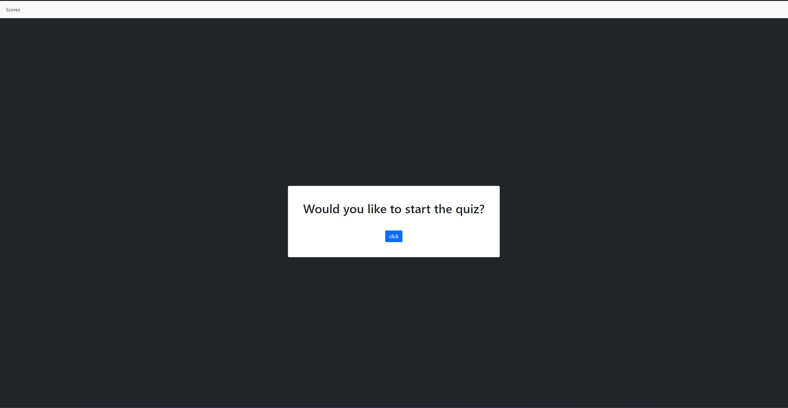

# Code Quiz

## Description

In order to gauge the progress of my peers learning how to code, I created a quiz application that tests their knowledge of some of the tools that we have learned. After using the application, users will be able to store their initials and test scores to see how well they stack up with their past grades. I learned how to properly utilize event listeners as well as incorporate bootstrap into my html so that I could easily change css properties.

## Website

## Link

Website Link: https://danieltbonn.github.io/code-quiz/scores.html

## Credits

Borrowed code for alerts straight and nav from the bootstrap website.

Link 1: https://getbootstrap.com/docs/5.1/components/alerts/
Link 2: https://getbootstrap.com/docs/5.1/components/navbar/